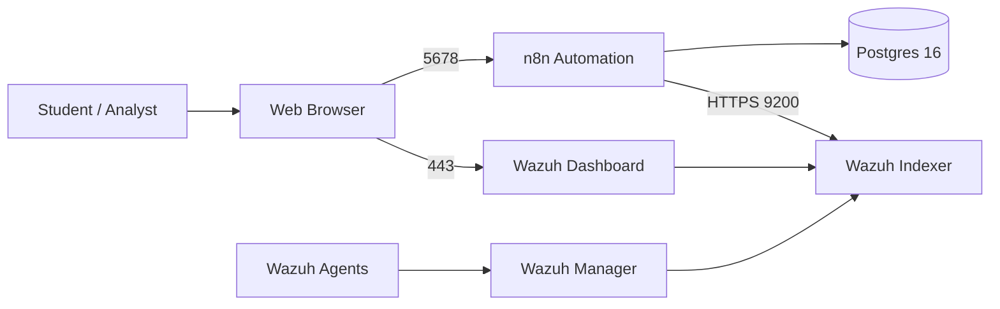

# n8n Lab (Ludus)

Author: **Howard Mukanda** (@ITSecurityLabs on YouTube and X)

This Ludus role deploys an **n8n + Postgres automation server (Docker)** on a Debian/Ubuntu Linux VM, intended for blue-team / purple-team labs where students build automation workflows for security and operations tasks. The original Wazuh components have been removed from this role so it now focuses purely on n8n while remaining compatible with existing Ludus range configs that reference `ludus_n8n`.

---

## 🧭 Example Use Case Architecture Overview




The diagram still shows a full Wazuh + n8n environment, which is useful if you pair this role with an external Wazuh deployment or a different Ludus role that provides Wazuh.

---

## 🧱 What This Role Does

When run on a Linux VM in Ludus, this role:

- Installs Docker Engine and the Docker Compose plugin if needed.
- Creates a base lab directory at `/home/<user>/cyber-lab/n8n` for n8n assets and configuration.
- Deploys **n8n** with:
  - A dedicated Postgres 16 container.
  - Persistent named volumes for Postgres data and `/home/node/.n8n`.
  - Environment variables in an `.env` file, including `N8N_ENCRYPTION_KEY` generated per deployment.
  - `N8N_SECURE_COOKIE` configurable via Ansible defaults (defaults to `false` for HTTP/IP access in labs).

This gives students a self-contained **n8n automation environment** that can be used alone or integrated with an existing Wazuh SIEM or other security tools via HTTP APIs and webhooks.

---

## 🔧 Prerequisites

- A running Ludus instance with CLI access.
- Proxmox templates:
  - `debian-12-x64-server-template`
  - `ubuntu-22.04-x64-server-template`
  - (Optional) `win11-22h2-x64-enterprise-template` if you still plan to deploy Windows clients in the same range.
- Ludus CLI authenticated for your user (see Ludus docs for initial setup and `ludus range` usage).

---

## 📦 Install Required Ansible Role

On the Ludus host, add this role:

```bash
# n8n server role (this repo)
ludus ansible roles add git+https://github.com/lmakonem/ludus_n8n.git
```

Verify installation:

```bash
ludus ansible roles list
```

You should see at least:

```text
ludus_n8n
```

If you also use Wazuh agents and a separate Wazuh manager role, you can still install `aleemladha.ludus_wazuh_agent` and point it at that external manager using `ludus_wazuh_siem_server` in your range config.

---

## 🧩 Sample Ludus Range Configuration

Create `config.yml` on the Ludus host:

```yaml
# yaml-language-server: $schema=https://docs.ludus.cloud/schemas/range-config.json

ludus:
  # Wazuh SIEM server (Unified XDR + SOCFORTRESS rules)
  - vm_name: "{{ range_id }}-wazuh-siem"
    hostname: "{{ range_id }}-wazuh-siem"
    template: ubuntu-22.04-x64-server-template
    vlan: 20
    ip_last_octet: 11             
    ram_gb: 8
    cpus: 4
    linux: true
    testing:
      snapshot: false
      block_internet: false
    roles:
      - aleemladha.wazuh_server_install
    role_vars:
      wazuh_admin_password: "WazuhLab2026*"

  # n8n + Postgres automation server
  - vm_name: "{{ range_id }}-n8n-server"
    hostname: "{{ range_id }}-n8n-server"
    template: debian-12-x64-server-template
    vlan: 20
    ip_last_octet: 10        
    ram_gb: 6
    cpus: 4
    linux: {}
    testing:
      snapshot: false
      block_internet: false
    roles:
      - ludus_n8n

  # Windows 11 client with Wazuh agent
  - vm_name: "{{ range_id }}-win11-client-1"
    hostname: "{{ range_id }}-win11-client-1"
    template: win11-22h2-x64-enterprise-template
    vlan: 20
    ip_last_octet: 20        
    ram_gb: 4
    cpus: 2
    windows: {}
    testing:
      snapshot: false
      block_internet: false
    roles:
      - aleemladha.ludus_wazuh_agent
    role_vars:
      # MSI package
      wazuh_agent_install_package: "https://packages.wazuh.com/4.x/windows/wazuh-agent-4.9.0-1.msi"
      # Public manager variable
      ludus_wazuh_siem_server: "10.2.20.11"
      # Internal variants the role code expects in different places
      wazuhmanagerhost: "10.2.20.11"      # what Ludus has been flattening
      wazuh_manager_host: "10.2.20.11"    # what windows.yml is referencing 
  # Ubuntu 22.04 client with Wazuh agent
  - vm_name: "{{ range_id }}-ubuntu-client-1"
    hostname: "{{ range_id }}-ubuntu-client-1"
    template: ubuntu-22.04-x64-server-template
    vlan: 20
    ip_last_octet: 21           
    ram_gb: 4
    cpus: 2
    linux: {}
    testing:
      snapshot: false
      block_internet: false
    roles:
      - aleemladha.ludus_wazuh_agent
    role_vars:
      ludus_wazuh_siem_server: "10.2.20.11"
      wazuhmanagerhost: "10.2.20.11"
      wazuh_manager_host: "10.2.20.11"
```

This example deploys a single n8n server plus optional Windows and Ubuntu clients that you can use as traffic generators or automation targets;  Wazuh manager and agents are added to windows and linux


- windows wazuh agent
---

## 🚀 Apply and Deploy

```bash
ludus range config set -f config.yml
ludus range deploy
ludus range logs -f
```

This will:

- Provision a Debian server running **n8n + Postgres** via Docker.
- Optionally provision Windows 11 and Ubuntu clients if included in `config.yml`.

Once deployment completes, n8n will be exposed on the configured `N8N_PORT` (default `5678`) on the server IP; you can access it directly from your browser inside the same network.

---

## 🔍 Verifying n8n Deployment

SSH to the n8n server VM and run:

```bash
docker ps
```

You should see at least:

- `n8n`
- `n8n_postgres`

By default:

- n8n listens on port `5678` (or your overridden `n8n_port`).
- Postgres is reachable only inside the Docker network as `postgres:5432` for the n8n container.

If you change `n8n_port` in `defaults/main.yml` or via `role_vars`, redeploy the role with:

```bash
ludus range deploy -t user-defined-roles
```

to apply the new port mapping.

---

## 🧪 Lab Usage Ideas

With n8n running, students can:

- Build workflows that:
  - Ingest alerts from external SIEMs (including Wazuh, if deployed elsewhere) via webhooks or REST APIs.
  - Enrich events with OSINT (VirusTotal, Shodan, etc.) and store results in Postgres.
  - Send notifications to Slack, Teams, Discord, or email based on alert content.
- Prototype SOAR-style **automated triage and response** against any JSON-based security event source, then later plug in a real Wazuh or other SIEM backend.

The role stays intentionally minimal so it can be reused across many different ranges where n8n acts as the central **automation hub** instead of bundling a specific SIEM implementation.
