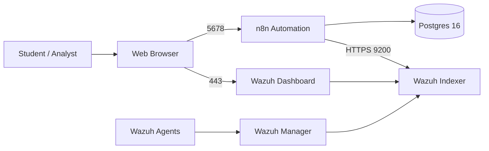

# Wazuh + n8n Lab (Ludus)

Author: **Howard Mukanda** (@ITSecurityLabs on YouTube and X)

This Ludus role deploys a **single-node Wazuh stack (Docker)** and an **n8n + Postgres automation server (Docker)** on a Debian/Ubuntu Linux VM. It is designed for blue-team / purple-team labs where students query Wazuh alerts via n8n workflows.

---

## 🧭 Architecture Overview




---

## 🧱 What This Role Does

When run on a Linux VM in Ludus, this role:

- Installs Docker Engine and the Docker Compose plugin if needed
- Sets `vm.max_map_count=262144` for Wazuh indexer stability
- Deploys **n8n** with:
  - A dedicated Postgres 16 container
  - Persistent volumes for Postgres and `/home/node/.n8n`
  - `N8N_SECURE_COOKIE=false` for HTTP access in labs
- Deploys **Wazuh 4.9.0 single-node** using the official `wazuh-docker` repository:
  - Generates indexer certificates
  - Starts manager, indexer, and dashboard containers
- Connects n8n to the Wazuh Docker network so it can query the indexer internally

This gives students a self-contained **Wazuh + n8n environment** for building automation workflows against Wazuh alerts and indexer data.

---

## 🔧 Prerequisites

- A running Ludus instance with CLI access
- Proxmox templates:
  - `debian-12-x64-server-template`
  - `ubuntu-22.04-x64-server-template`
  - `win11-22h2-x64-enterprise-template`
- Ludus CLI authenticated for your user (see Ludus docs for initial setup)

---

## 📦 Install Required Ansible Roles

On the Ludus host:

```bash
# Wazuh + n8n server role (this repo)
ludus ansible roles add git+https://github.com/lmakonem/ludus_wazuh_n8n.git

# Wazuh agent role for Windows/Linux clients
ludus ansible roles add aleemladha.ludus_wazuh_agent
```

Verify installation:

```bash
ludus ansible roles list
```

You should see at least:

```text
ludus_wazuh_n8n
aleemladha.ludus_wazuh_agent
```

The agent role comes from Ansible Galaxy and is designed to work with Ludus by taking a `ludus_wazuh_siem_server` variable that points at the Wazuh manager.

---

## 🧩 Sample Ludus Range Configuration

Create `config.yml` on the Ludus host:

```yaml
# yaml-language-server: $schema=https://docs.ludus.cloud/schemas/range-config.json

ludus:
  # Wazuh + n8n server (manager)
  - vm_name: "{{ range_id }}-wazuh-n8n-server"
    hostname: "{{ range_id }}-wazuh-n8n-server"
    template: debian-12-x64-server-template
    vlan: 20
    ip_last_octet: 10
    ram_gb: 8
    cpus: 4
    linux: {}
    testing:
      snapshot: false
      block_internet: false
    roles:
      - ludus_wazuh_n8n

  # Windows 11 client with Wazuh agent
  - vm_name: "{{ range_id }}-win11-client-1"
    hostname: "{{ range_id }}-win11-client-1"
    template: win11-22h2-x64-enterprise-template
    vlan: 20
    ip_last_octet: 20
    ram_gb: 4
    cpus: 2
    windows: {}
    testing:
      snapshot: false
      block_internet: false
    roles:
      - aleemladha.ludus_wazuh_agent
    role_vars:
      ludus_wazuh_siem_server: "10.{{ range_id }}.20.10"
      wazuh_agent_version: "4.9.0"
      wazuh_agent_groups:
        - "default"

  # Ubuntu 22.04 client with Wazuh agent
  - vm_name: "{{ range_id }}-ubuntu-client-1"
    hostname: "{{ range_id }}-ubuntu-client-1"
    template: ubuntu-22.04-x64-server-template
    vlan: 20
    ip_last_octet: 21
    ram_gb: 4
    cpus: 2
    linux: {}
    testing:
      snapshot: false
      block_internet: false
    roles:
      - aleemladha.ludus_wazuh_agent
    role_vars:
      ludus_wazuh_siem_server: "10.{{ range_id }}.20.10"
      wazuh_agent_version: "4.9.0"
      wazuh_agent_groups:
        - "default"
```
---

## 🚀 Apply and Deploy

```bash
ludus range config set -f config.yml
ludus range deploy
ludus range logs -f
```

This will:

- Provision a Debian server running Wazuh single-node (Docker) and n8n + Postgres (Docker)
- Provision Windows 11 and Ubuntu clients with Wazuh agents pointing at the manager

---

## 🔍 Verifying Wazuh Agent Registration

### On the Wazuh + n8n Server

```bash
docker ps
```

Confirm the following containers are running:

- `single-node-wazuh.indexer-1`
- `single-node-wazuh.manager-1`
- `single-node-wazuh.dashboard-1`
- `n8n`
- `n8n_postgres`

The manager should expose ports **1514**, **1515**, and **55000** on `0.0.0.0`.

---

### On the Windows Client

Confirm the agent is installed:

```powershell
Get-Service Wazuh*
```

Check the agent log:

```text
C:\Program Files (x86)\ossec-agent\logs\ossec.log
```

If needed, force a redeploy:

```powershell
Stop-Service WazuhSvc -ErrorAction SilentlyContinue
```

Then redeploy:

```bash
ludus range deploy -t user-defined-roles
```

---

### On the Ubuntu Client

```bash
systemctl status wazuh-agent
sudo grep -A4 "<server>" /var/ossec/etc/ossec.conf
```

Ensure the `<address>` matches the Wazuh manager IP.

---

## 🧪 Lab Usage Ideas

Once Wazuh and n8n are operational:

- Query the Wazuh indexer for:
  - High-severity alerts
  - Brute-force login attempts
  - Ransomware-like file activity
- Use n8n to:
  - Send alerts to Slack / Teams / Discord
  - Create ITSM tickets
  - Trigger additional scans or scripts on endpoints

The Dockerized Wazuh stack and n8n automation server together provide a **self-contained environment** for practicing SIEM triage, alert enrichment, and automated response.
